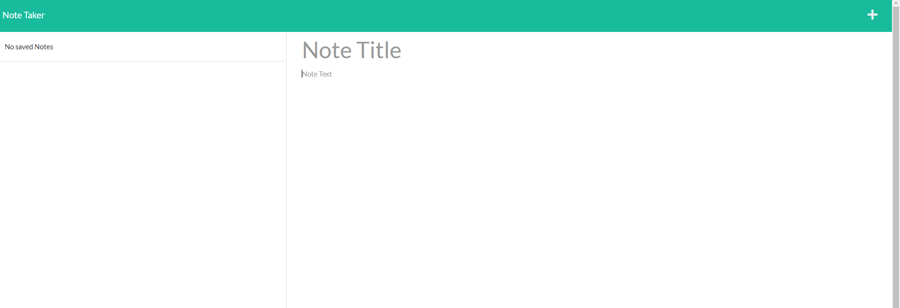

# 11 Express.js: Note Taker

## Your Task

Your assignment is to modify starter code to create an application called Note Taker that can be used to write and save notes. This application will use an Express.js back end and will save and retrieve note data from a JSON file.

The application’s front end has already been created. It's your job to build the back end, connect the two, and then deploy the entire application to Heroku.


## User Story

```
AS A small business owner
I WANT to be able to write and save notes
SO THAT I can organize my thoughts and keep track of tasks I need to complete
```
https://herokuminiprojectming.herokuapp.com/notes

https://github.com/zmzhong1/Note-Taker

